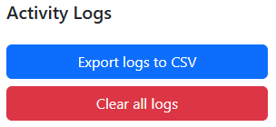

# Activity Log Exporter Chrome Extension

**Track your active tabs, windows, and time spent in Chrome – and easily export or clear your activity logs.**

## Features

- Records every Chrome tab and window switch, including URL and page title
- Tracks session start/end time and duration in seconds
- Logs are stored locally in your Chrome profile (using chrome.storage.local)
- Export all activity logs to a CSV file with one click
- Clear all stored logs with a single button
- Responsive and clean popup interface using Bootstrap

## Installation

1. **Clone or download this repository**
2. Open chrome://extensions/ in your Chrome browser
3. Enable **Developer mode** (top-right)
4. Click **"Load unpacked"** and select the extension folder

## Usage

- The extension automatically logs your tab/window activity in the background.
- Click the extension icon to open the popup.
- Click **"Export logs to CSV"** to download your activity logs as a CSV file.
- Click **"Clear all logs"** to erase all stored logs.
- Status messages will inform you of successful exports or deletions.

## Privacy

All logs are stored **locally** in your Chrome profile and are never sent anywhere. You are the only one who can access, export, or clear this data.

## Permissions

The extension requires the following permissions:

- tabs, webNavigation, windows - for accurate activity tracking
- storage - to save and retrieve logs

## Screenshots

## Customization

Feel free to modify the code to fit your workflow!  
Want to add analytics, more export formats, or filters? Contributions and ideas are welcome.

## License

MIT License